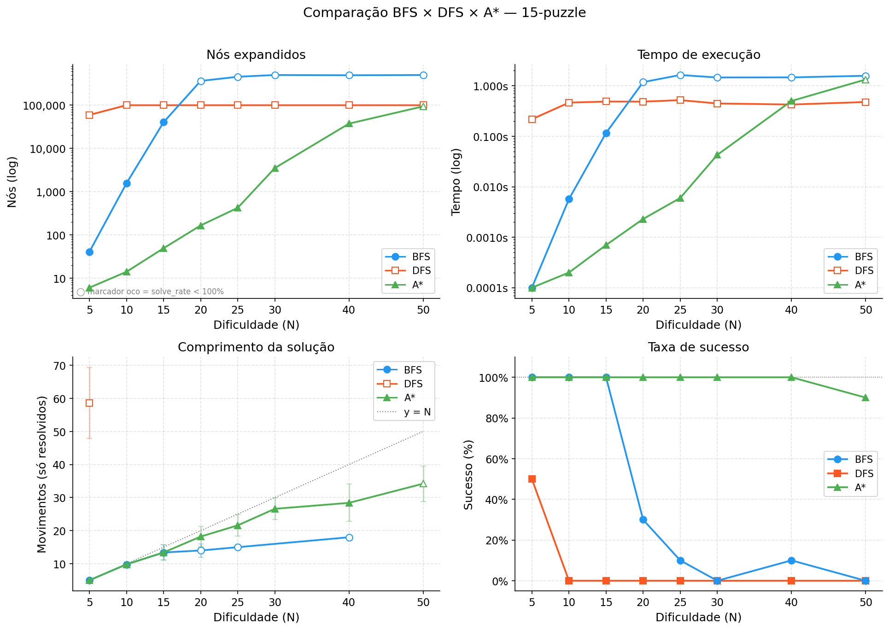

# TP1 — Fundamentos de Inteligência Artificial
**UFMG — Departamento de Engenharia Elétrica**
Prof. Cristiano Castro — 2026/1

Este trabalho implementa e compara agentes de busca para o **15-puzzle** (quebra-cabeça de 15 peças), cobrindo desde a modelagem do estado e a análise de solucionabilidade até a implementação de três algoritmos (BFS, DFS e A*) e uma avaliação experimental comparativa entre eles.

---

## Estrutura do projeto

```
tp-fund-ia/
├── puzzle/
│   ├── __init__.py
│   ├── state.py          # Modelagem do estado
│   ├── solvability.py    # Verificação de solucionabilidade (Tarefa 1)
│   ├── generator.py      # Geração aleatória de estados (Tarefa 2)
│   └── search/
│       ├── __init__.py
│       ├── bfs.py        # Busca em largura — BFS (Tarefa 3)
│       ├── dfs.py        # Busca em profundidade — DFS (Tarefa 3)
│       └── astar.py      # Busca A* com heurística Manhattan (Tarefa 4)
├── benchmark/
│   ├── __init__.py
│   ├── generator.py      # Geração de instâncias por caminhada aleatória
│   ├── run.py            # Runner + exportação CSV + tabela de resumo
│   ├── plot.py           # Gráficos matplotlib + tabelas LaTeX
│   └── results/
│       ├── results.csv   # Dados brutos (uma linha por instância × algoritmo)
│       ├── summary.csv   # Médias agrupadas por (dificuldade, algoritmo)
│       ├── figures/      # PNGs gerados por plot.py
│       └── tables/       # Tabelas .tex geradas por plot.py
├── tests/
│   ├── test_state.py         # Testes da modelagem
│   ├── test_solvability.py   # Testes de solucionabilidade e geração
│   ├── test_bfs.py           # Testes de BFS (8-puzzle e 15-puzzle)
│   ├── test_dfs.py           # Testes de DFS (8-puzzle e 15-puzzle)
│   └── test_astar.py         # Testes de A* e heurística Manhattan
└── README.md
```

---

## Fase 1 — Modelagem e estrutura do projeto

### Representação do estado

O estado do jogo é representado como uma **tupla de 16 inteiros** (`tuple[int]`), onde cada posição corresponde a uma célula da grade 4×4 lida da esquerda para a direita e de cima para baixo. O valor `0` representa o espaço vazio.

```
índices:        exemplo de estado:
 0  1  2  3      1  2  3  4
 4  5  6  7      5  6  7  8
 8  9 10 11      9 10 11 12
12 13 14 15     13 14 15  _
```

A escolha por `tuple` (em vez de lista ou matriz) é deliberada: tuplas são **hasháveis**, o que permite armazená-las diretamente em `set` e `dict` — estruturas essenciais para detectar estados visitados e evitar ciclos nos algoritmos de busca.

### Estado objetivo

```python
GOAL_STATE = (1, 2, 3, 4, 5, 6, 7, 8, 9, 10, 11, 12, 13, 14, 15, 0)
```

As peças estão ordenadas de 1 a 15, com o espaço vazio na última posição.

### Funções implementadas (`puzzle/state.py`)

| Função | Descrição |
|--------|-----------|
| `find_blank(state)` | Retorna o índice do espaço vazio (`0`) no estado |
| `get_neighbors(state)` | Retorna lista de estados obtidos por movimentos válidos |
| `is_goal(state)` | Verifica se o estado é o estado objetivo |
| `print_state(state)` | Imprime o estado em formato de grade 4×4 |

### Geração de vizinhos

A função `get_neighbors` identifica a posição do espaço vazio (linha e coluna via `divmod`) e gera até 4 vizinhos deslocando o espaço vazio nas direções válidas:

- **Cima**: possível se `linha > 0` → troca com índice `vazio - 4`
- **Baixo**: possível se `linha < 3` → troca com índice `vazio + 4`
- **Esquerda**: possível se `coluna > 0` → troca com índice `vazio - 1`
- **Direita**: possível se `coluna < 3` → troca com índice `vazio + 1`

Posições de canto geram **2 vizinhos**, bordas geram **3**, e posições internas geram **4**.

### Testes realizados

Os testes em `tests/test_state.py` verificaram:
- Formato e valor do estado objetivo
- Localização correta do espaço vazio em diferentes posições
- Número correto de vizinhos para cantos (2), bordas (3) e centro (4)
- Identidade dos estados vizinhos gerados (valores conferidos manualmente)

Todos os testes passaram com sucesso.

---

## Fase 2 — Tarefa 1: Solucionabilidade e Tarefa 2: Geração Aleatória

### Tarefa 1 — Verificação de solucionabilidade (`puzzle/solvability.py`)

Para um grid de largura par (N = 4), a solucionabilidade depende de dois fatores combinados:

1. **Número de inversões**: um par (i, j) com i < j é uma inversão quando `state[i] > state[j]`, desconsiderando o espaço vazio. A contagem é feita em O(n²) sobre a sequência de peças sem o blank.

2. **Linha do espaço vazio a partir de baixo** (base 1): calculada como `SIZE - (blank_index // SIZE)`.

**Condição de solucionabilidade:**

```
(inversions + blank_row_from_bottom) % 2 == 1
```

Isso equivale a:
- blank em linha **ímpar** do fundo → inversões devem ser **pares**
- blank em linha **par** do fundo   → inversões devem ser **ímpares**

Verificação com o estado objetivo: 0 inversões + linha 1 (ímpar) → (0+1) % 2 = 1 ✓

| Função | Descrição |
|--------|-----------|
| `count_inversions(state)` | Conta pares fora de ordem, ignorando o blank |
| `is_solvable(state)` | Aplica a regra e retorna `True`/`False` |

### Tarefa 2 — Geração aleatória de estados (`puzzle/generator.py`)

A geração adota três etapas:

1. Embaralha aleatoriamente as 16 peças com `random.shuffle`.
2. Verifica a solucionabilidade com `is_solvable`.
3. Se insolúvel, **corrige a paridade** trocando as duas primeiras peças não-vazias — isso altera o número de inversões em 1 (inverte a paridade) sem deslocar o espaço vazio, tornando o estado solucionável.

Essa abordagem é O(1) para a correção e evita o descarte e re-embaralhamento de estados.

A função aceita um parâmetro opcional `seed` para reprodutibilidade dos experimentos.

```python
state = generate_random_state()          # estado aleatório solucionável
state = generate_random_state(seed=42)   # reprodutível
```

### Testes realizados

Os testes em `tests/test_solvability.py` cobriram:
- Estado objetivo com 0 inversões
- Estado com inversões contadas manualmente (15..1 → 105 inversões)
- Verificação de que o blank é ignorado na contagem
- Estados solucionáveis e insolúveis conhecidos (troca de peças adjacentes no objetivo)
- Blank em linhas diferentes com paridades variadas
- 100 estados gerados aleatoriamente: todos solucionáveis
- Validade (exatamente as peças 0–15), tipo `tuple`, hashabilidade
- Reprodutibilidade (mesma seed → mesmo estado) e variedade (seeds diferentes → estados diferentes)

Todos os testes passaram com sucesso.

---

## Fase 3 — Tarefa 3: Busca em Largura (BFS)

### Algoritmo (`puzzle/search/bfs.py`)

BFS explora o grafo de estados camada por camada, garantindo que a primeira
solução encontrada seja a de menor número de movimentos (ótima).

Estruturas utilizadas:
- `collections.deque` como fila FIFO para os estados a expandir.
- `dict` `parent[state] = predecessor` para registrar o caminho e evitar
  revisitar estados (funciona como conjunto de visitados e como estrutura de
  reconstrução ao mesmo tempo).

O caminho é reconstruído percorrendo o dicionário `parent` do estado objetivo
até o estado inicial e invertendo a lista resultante.

A busca retorna um dicionário com quatro métricas:

| Campo | Descrição |
|-------|-----------|
| `solution` | Lista de estados do inicial ao objetivo, ou `None` |
| `nodes_expanded` | Número de nós expandidos |
| `solution_length` | Número de movimentos até a solução, ou `None` |
| `elapsed_time` | Tempo de execução em segundos |

Um parâmetro `max_nodes` (padrão: 500 000) interrompe a busca caso o limite
seja atingido, evitando travamento em casos intratáveis.

O parâmetro `size` (padrão: 4) permite usar o mesmo código para o 8-puzzle
(size=3), facilitando validação com soluções conhecidas.

```python
from puzzle.search import bfs
from puzzle.state import GOAL_STATE

result = bfs(initial_state)
# result['solution']        → lista de estados
# result['nodes_expanded']  → int
# result['solution_length'] → int
# result['elapsed_time']    → float
```

### Limitações do BFS no 15-puzzle

Apesar de ser **completo** e **ótimo**, o BFS tem complexidade de tempo e espaço
exponencial em função da profundidade da solução. No 15-puzzle, soluções com
mais de ~20 movimentos tornam o consumo de memória impraticável. Por esse motivo,
os testes cobrem apenas configurações com poucos movimentos a partir do objetivo.

### Testes realizados (`tests/test_bfs.py`)

- **8-puzzle (3×3)**: estados a 0, 1, 2 e 4 movimentos do objetivo com soluções
  conferidas manualmente; caminho conectado; comportamento correto sob limite
  de nós; coerência das métricas.
- **15-puzzle (4×4)**: estados a 1, 2 e 5 movimentos do objetivo; caminho
  conectado; crescimento dos nós expandidos com a profundidade.

Todos os testes passaram com sucesso.

---

## Fase 4 — Tarefa 3: Busca em Profundidade (DFS)


### Algoritmo (`puzzle/search/dfs.py`)

DFS explora o grafo de estados descendo o mais fundo possível em cada ramo
antes de retroceder. Utiliza uma **pilha explícita** (lista Python com `append`/`pop`).

Estruturas utilizadas:
- `list` como pilha LIFO. Cada entrada armazena `(state, path)`, onde `path`
  é a tupla de estados desde o inicial até o atual.
- `set(path)` — derivado do caminho a cada expansão — para detectar ciclos
  **no caminho atual** em O(1). Estados visitados em outros ramos podem ser
  revisitados, preservando o comportamento natural do DFS.

Dois limites controlam a busca:

| Parâmetro | Padrão | Descrição |
|-----------|--------|-----------|
| `max_depth` | 50 | Profundidade máxima. Nós além desse nível não são expandidos. |
| `max_nodes` | 500 000 | Nós expandidos totais. Interrompe a busca se excedido. |

O retorno segue o mesmo contrato do BFS (`solution`, `nodes_expanded`,
`solution_length`, `elapsed_time`), facilitando a comparação entre os algoritmos.

### Comparação com BFS

A tabela a seguir resume as principais diferenças teóricas e práticas entre os dois algoritmos para o 15-puzzle:

| Propriedade | BFS | DFS |
|-------------|-----|-----|
| Ótimo | Sim (menor nº de movimentos) | Não |
| Completo | Sim (dentro do limite de nós) | Sim (com limite de profundidade) |
| Memória | O(b^d) — alto | O(b·m) — baixo |
| 15-puzzle prático | Casos fáceis | Apenas 1–2 movimentos do objetivo |

### Limitação observada no 15-puzzle

O DFS é impraticável para o 15-puzzle mesmo em estados a poucos movimentos
do objetivo. Por explorar preferencialmente ramos de profundidade 50, o algoritmo
esgota `max_nodes` antes de encontrar qualquer solução. Esse comportamento
foi documentado no teste `test_15_impractical_for_deeper_states`.

### Testes realizados (`tests/test_dfs.py`)

- **8-puzzle (3×3)**: estados a 0, 1, 2 e 4 movimentos do objetivo; caminho
  conectado; solução ≥ BFS (não-otimalidade confirmada); limite de
  profundidade e de nós funcionando corretamente.
- **15-puzzle (4×4)**: estados a 1 e 2 movimentos do objetivo; caminho
  conectado; teste documentando a impraticabilidade para estados mais distantes.

Todos os testes passaram com sucesso.

---

## Fase 5 — Tarefa 4: Busca A* (`puzzle/search/astar.py`)

### Função de custo e heurística

| Função | Definição |
|--------|-----------|
| `g(n)` | Profundidade do nó — número de movimentos desde o estado inicial |
| `h(n)` | Distância de Manhattan — para cada peça (exceto o blank), soma `\|linha_atual − linha_obj\|` + `\|col_atual − col_obj\|` |
| `f(n)` | `g(n) + h(n)` — prioridade na fila |

A heurística de Manhattan é **admissível** (nunca superestima o custo real) e **consistente**, garantindo que A* encontre sempre a solução ótima.

### Algoritmo (`puzzle/search/astar.py`)

Estruturas utilizadas:
- `heapq` como fila de prioridade mínima. Cada entrada é `(f, g, counter, state)`.
  O campo `counter` desempata quando `f` e `g` são iguais, evitando a comparação direta de tuplas de estado.
- `g_score[state]` — menor custo conhecido até cada estado, usado para descartar entradas desatualizadas do heap (*lazy deletion*).
- `parent[state]` — estado predecessor no caminho ótimo, para reconstrução da solução.

O retorno segue o mesmo contrato de BFS e DFS:

| Campo | Descrição |
|-------|-----------|
| `solution` | Lista de estados do inicial ao objetivo, ou `None` |
| `nodes_expanded` | Número de nós expandidos |
| `solution_length` | Número de movimentos até a solução, ou `None` |
| `elapsed_time` | Tempo de execução em segundos |

```python
from puzzle.search.astar import astar, manhattan_distance
from puzzle.state import GOAL_STATE

result = astar(initial_state)
# result['solution']        → lista de estados
# result['nodes_expanded']  → int
# result['solution_length'] → int
# result['elapsed_time']    → float
```

### Vantagem sobre BFS e DFS

A heurística de Manhattan guia a busca em direção à solução, descartando sistematicamente ramos distantes do objetivo e expandindo uma fração ínfima dos nós que BFS precisaria explorar. O contraste é ilustrado na tabela abaixo, com uma instância a 20 movimentos do objetivo:

| Algoritmo | Nós expandidos | Resultado |
|-----------|---------------|-----------|
| BFS | 500 000 | falhou |
| DFS | 500 000 | falhou |
| **A\*** | **574** | **20 movimentos (ótimo)** |

### Testes realizados (`tests/test_astar.py`)

- **Heurística**: valor zero no estado objetivo; valor correto a 1 movimento; admissibilidade verificada contra BFS em 20 instâncias aleatórias.
- **8-puzzle (3×3)**: estados a 0, 1, 2 e 4 movimentos; caminho conectado; limite de nós; otimalidade idêntica ao BFS; A* expande menos nós que BFS.
- **15-puzzle (4×4)**: estados a 1 e 5 movimentos; caminho conectado; otimalidade idêntica ao BFS.
- **Instância difícil**: A* resolve em 574 nós uma instância que BFS não consegue em 500 000.

Todos os testes passaram com sucesso.

---

## Fase 6 — Tarefa 5: Benchmark e Comparação

### Metodologia

**Geração de instâncias de dificuldade controlada** (`benchmark/generator.py`):
cada instância é produzida aplicando N movimentos aleatórios a partir do estado objetivo — caminhada aleatória sem reversão imediata do passo anterior —, com N ∈ {5, 10, 15, 20, 25, 30, 40, 50}. São geradas 10 instâncias por nível, com sementes fixas para garantir reprodutibilidade.

**Configurações do runner** (`benchmark/run.py`):

| Parâmetro | Valor |
|-----------|-------|
| Instâncias por nível | 10 |
| `max_nodes` BFS / A* | 500 000 |
| `max_nodes` DFS | 100 000 |
| `max_depth` DFS | 80 |

### Resultados (10 instâncias por nível)

Legenda das colunas: `solve` = taxa de sucesso; `nodes` = média de nós expandidos; `len` = comprimento médio da solução (somente instâncias resolvidas); `t` = tempo médio de execução em segundos.

|  N  | BFS solve | BFS nodes | BFS len | BFS t(s) | DFS solve | DFS nodes | DFS len | DFS t(s) | A* solve | A* nodes | A* len | A* t(s) |
|-----|-----------|-----------|---------|----------|-----------|-----------|---------|----------|----------|----------|--------|---------|
|  5  | 1.00 |       40.5 |  5.0 | 0.0001 | 0.50 |    59 608 | 58.6 | 0.2185 | 1.00 |       6.0 |  5.0 | 0.0001 |
| 10  | 1.00 |    1 558.6 |  9.8 | 0.0057 | 0.00 |   100 000 |    — | 0.4653 | 1.00 |      14.0 |  9.8 | 0.0002 |
| 15  | 1.00 |   40 324.8 | 13.4 | 0.1166 | 0.00 |   100 000 |    — | 0.4892 | 1.00 |      49.1 | 13.4 | 0.0007 |
| 20  | 0.30 |  364 517.8 | 14.0 | 1.1865 | 0.00 |   100 000 |    — | 0.4870 | 1.00 |     165.3 | 18.2 | 0.0023 |
| 25  | 0.10 |  454 760.1 | 15.0 | 1.6422 | 0.00 |   100 000 |    — | 0.5215 | 1.00 |     422.9 | 21.6 | 0.0060 |
| 30  | 0.00 |  500 000.0 |    — | 1.4661 | 0.00 |   100 000 |    — | 0.4481 | 1.00 |   3 512.9 | 26.6 | 0.0429 |
| 40  | 0.10 |  493 376.4 | 18.0 | 1.4725 | 0.00 |   100 000 |    — | 0.4268 | 1.00 |  37 495.2 | 28.4 | 0.5018 |
| 50  | 0.00 |  500 000.0 |    — | 1.5858 | 0.00 |   100 000 |    — | 0.4787 | 0.90 |  93 956.7 | 34.2 | 1.3356 |

### Ponto de falha de cada algoritmo

| Algoritmo | Primeiro nível com falha | Observação |
|-----------|--------------------------|------------|
| **DFS** | N = 5 (solve_rate = 0.50) | Falha desde casos triviais; exploração exaustiva sem guia heurístico |
| **BFS** | N = 20 (solve_rate = 0.30) | Memória/tempo esgotados para profundidades ≥ 18–20 |
| **A\*** | N = 50 (solve_rate = 0.90) | Ainda resolve quase tudo; falha apenas quando a distância real exige >93 k nós |

### Conclusões

- **DFS** é impraticável para o 15-puzzle: mesmo em instâncias a apenas 5 movimentos do objetivo, já falha em 50% dos casos. Sem guia heurístico, o algoritmo percorre ramos profundos e irrelevantes até atingir o limite de nós.
- **BFS** é ótimo e completo para instâncias fáceis (N ≤ 15), mas o crescimento exponencial de memória o inviabiliza a partir de ~20 movimentos.
- **A\*** supera os dois: resolve todos os casos até N = 40, expandindo **3 a 5 ordens de grandeza menos nós** que o BFS (ex.: 165 vs. 364 518 em N = 20) e com **tempo ~500× menor**. O diferencial é a heurística de Manhattan, que descarta sistematicamente ramos distantes da solução.

Os dados brutos estão em `benchmark/results/results.csv` e as médias em `benchmark/results/summary.csv`.

---

## Fase 7 — Análise dos Resultados e Geração de Gráficos

### Figuras geradas (`benchmark/plot.py`)

O script lê os arquivos CSV gerados pelo benchmark e produz cinco figuras em `benchmark/results/figures/`:

| Arquivo | Conteúdo |
|---------|----------|
| `nodes_vs_difficulty.png` | Nós expandidos × dificuldade (escala log) |
| `time_vs_difficulty.png` | Tempo de execução × dificuldade (escala log) |
| `solution_length_vs_difficulty.png` | Comprimento da solução × dificuldade (só instâncias resolvidas) |
| `solve_rate_vs_difficulty.png` | Taxa de sucesso × dificuldade |
| `all_metrics.png` | Grade 2×2 com todos os painéis acima |

Convenção visual: marcador **sólido** = algoritmo resolveu 100% das instâncias; marcador **oco** = pelo menos uma falha no nível.

### Tabelas LaTeX geradas

Três arquivos em `benchmark/results/tables/`, prontos para `\input{}` no relatório:

| Arquivo | Conteúdo |
|---------|----------|
| `tab_nodes.tex` | Média de nós expandidos; valores no teto marcados com †  |
| `tab_time.tex` | Tempo médio de execução em segundos |
| `tab_solution.tex` | Comprimento médio da solução + taxa de sucesso |

### Figura combinada



Os quatro painéis mostram simultaneamente:
- **Nós expandidos** (log): A* cresce lentamente enquanto BFS e DFS batem no teto rapidamente.
- **Tempo** (log): A* é consistentemente 2–3 ordens de grandeza mais rápido.
- **Comprimento da solução**: BFS e A* encontram soluções ótimas (≈ N movimentos); DFS encontra caminhos muito longos quando resolve.
- **Taxa de sucesso**: DFS falha desde N = 5; BFS colapsa em N = 20–30; A* mantém 100% até N = 40.
